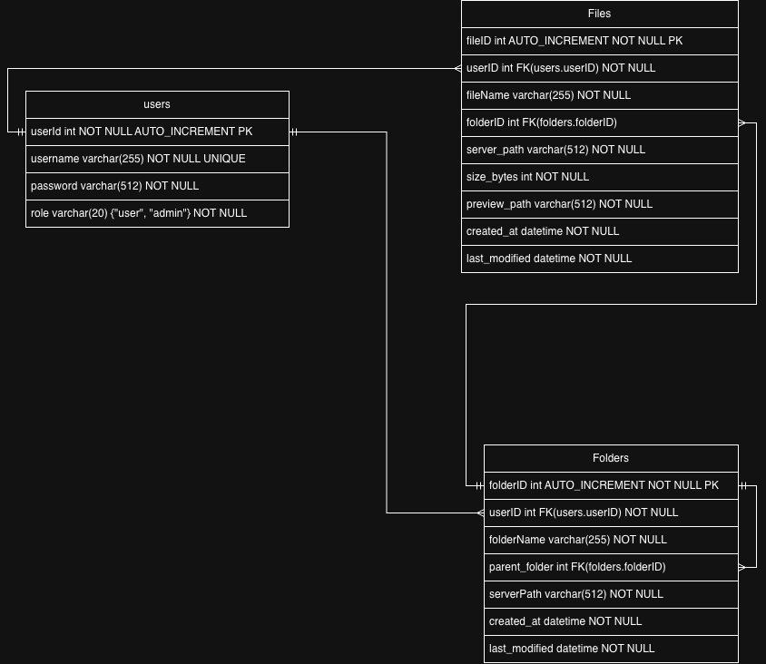

# NoSocial.life

Privāta mājas mākoņkrātuve + Home Media Server (DLNA/UPnP), ko var uzstādīt uz sava servera un izmantot kā bezmaksas alternatīvu komerciāliem “cloud” risinājumiem.

##  Idejas apraksts
 NoSocial.life ir web risinājums mājas failu glabāšanai, kas ļauj lietotājam droši augšupielādēt, pārvaldīt un lejupielādēt failus no jebkuras vietas pasaulē. Projekta galvenā ideja ir izveidot privātu “cloud storage” sistēmu, kuru ikviens var uzstādīt uz sava mājas servera un izmantot kā alternatīvu komerciāliem mākoņpakalpojumiem. Atšķirībā no lielajiem servisiem, kuros bieži tiek noteikti ierobežojumi krātuves apjomam vai tiek pieprasīta abonēšanas maksa, NoSocial.life būs pilnībā bezmaksas un open-source, bet krātuves lielums būs atkarīgs tikai no pieejamajiem diskiem.

Sistēmas pamatfunkcijas ietver lietotāju pārvaldību un failu apmaiņu. Lietotājam būs iespējams reģistrēties, ielogoties un izmantot savu profilu failu glabāšanai. Lietotnē tiks realizēti divi lietotāju tipi: admin, kurš pārvalda lietotājus un sistēmas konfigurāciju, un user, kurš ikdienā izmanto failu augšupielādes un lejupielādes iespējas. Katram lietotājam pēc noklusējuma būs pieejami tikai viņa personīgie faili, tādējādi tiek nodrošināta privātuma aizsardzība starp dažādiem kontiem.

NoSocial.life lietotāja interfeiss būs veidots kā ērts File Explorer ar mapju struktūru un vizuālu failu attēlojumu, kas līdzinās populāriem mākoņservisiem. Tas ļaus lietotājam vienkārši pārvietoties pa direktorijām, pārskatīt failu sarakstu un veikt darbības ar failiem bez tehniskām zināšanām. Kā svarīga funkcija tiek plānota arī meklēšana pēc failu vai mapju nosaukumiem, lai lielā failu apjomā lietotājs ātri atrastu nepieciešamo informāciju. Ja izstrādes laikā pietiks resursu, tiks pievienotas papildfunkcijas, piemēram, failu koplietošana ar citiem lietotājiem vai publisku direktoriju izveide.

Īpaša projekta daļa ir multimediju iespējas lokālajā tīklā. Sistēmā būs kopējā mape Movies, kurā tiks glabāti MP4 video faili. Šos failus būs iespējams skatīties televizorā, izmantojot Home Media Server funkciju ar DLNA/UPnP. Lietotājs televizorā varēs izvēlēties serveri kā multimediju avotu un atskaņot filmas bez papildu ierīcēm vai failu kopēšanas uz USB datu nesējiem.

Projekts paredzēts darbam uz mājas servera ar Ubuntu Linux, izmantojot domēnu nosocial.life un drošu HTTPS savienojumu. Lai efektīvi izmantotu serverī pieejamos vairākus cietos diskus, tiks izstrādāts algoritms failu saglabāšanai, kas izvēlas disku ar vislielāko brīvo vietu, tādējādi vienmērīgi sadalot datu apjomu un samazinot risku, ka viens disks piepildās daudz ātrāk par pārējiem. Metadati par failiem un mapēm tiks glabāti MySQL datubāzē, kas nodrošinās ātru failu meklēšanu un pārvaldību.

NoSocial.life izstrāde tiek plānota 3–4 mēnešiem, pakāpeniski realizējot dizainu, lietotāju sistēmu, failu loģiku, Home Media Server moduli, testēšanu un gala demonstrāciju. Gala rezultāts būs stabila, ātra un ērta mājas mākoņkrātuve ar iespēju piekļūt failiem no jebkuras vietas un skatīties filmas lokālajā tīklā.

## Problēmas analīze

Mūsdienās cilvēki uzkrāj lielu daudzumu digitālo datu: dokumentus, foto, video, projektu failus un rezerves kopijas. Bieži šie faili glabājas dažādās ierīcēs (telefonos, datoros, ārējos diskos), kas sarežģī to pārvaldību un palielina datu pazaudēšanas risku.

Komerciālie mākoņpakalpojumi piedāvā vienkāršu failu sinhronizāciju, bet tie var būt maksas, ierobežot krātuves apjomu vai radīt privātuma jautājumus, jo dati faktiski tiek glabāti trešo pušu serveros.

NoSocial.life risina šo problēmu, piedāvājot mājas mākoņkrātuvi, kur lietotājs pats kontrolē datu glabāšanu un servera infrastruktūru. Turklāt projekts piedāvā vienotu vidi failu pārvaldībai ar attālinātu piekļuvi un lokālā tīkla multimediju iespējām.

## Mērķauditorija / Lietotāji

NoSocial.life paredzēts mājas lietotājiem, kuri:

 • vēlas glabāt failus vienā drošā vietā;
 • vēlas piekļūt saviem datiem no jebkuras ierīces un vietas;
 • nevēlas maksāt par komerciālu mākoņpakalpojumu;
 • vēlas risinājumu ar iespēju to uzstādīt savā serverī (piemēram, uz veca datora vai mājas NAS).

## Lietotāju tipi sistemē

Admin
 - pārvalda lietotājus, servera konfigurāciju un piekļuves tiesības.

User
 - ikdienas lietotājs, kas augšupielādē un lejupielādē savus failus.

## Kāpēc Vērts Risinājumu Izstradāt

Šāda risinājuma izstrāde ir vērtīga, jo tā apvieno vairākas reālas praktiskās vajadzības vienā projektā:

 • privāta datu glabāšana bez trešo pušu ietekmes;
 • piekļuve failiem attālināti caur internetu;
 • iespēja izmantot serveri kā multimediju avotu (filmu skatīšanās TV ar DLNA/UPnP);
 • elastīga krātuves mērogošana atkarībā no pieejamajiem diskiem;
 • open-source pieeja ļauj projektam attīstīties un tikt pielāgotam dažādiem lietošanas scenārijiem.

Tāpat projekts ļauj padziļināti apgūt vairākas programmēšanas un sistēmu izstrādes tēmas, piemēram:

 • autentifikāciju;
 • failu sistēmas loģiku;
 • datubāzes izmantošanu;
 • tīmekļa UI;
 • drošību;
 • servera izvietošanu.

## Datubāzes struktūra

## Darba plāns 

| Nedēļas Nr. | Darba apraksts | Datums | Autors |
|------------|---------------|--------|--------|
| 1 | Projekta skeleta izstrādāšana (repozitorijs, mapju sistēma `/app`, `/templates`, `/static`, `/db`, `/router`, `/services` utt.), datubāzes izveide, env uzstādīšana. FrontEnd: login/register template, fileExplorer template, admin panel | 17.01.2026 | Arturs |
| 2 | Register/login sistēmas izveide, sesijas pārvalde, admin panel | 24.01.2026 | Arturs |
| 3-6 | FileExplorer funkcionalitātes izstrāde (augšupielāde, lejupielāde, failu pārvalde, disku pieejamās atmiņas optimizēšana utt.) | 21.02.2026 | Arturs |
| 7-8 | HMS izveide | 07.03.2026 | Arturs |
| 9-10 | Testēšana uz servera + kļūdu labojumi | 21.03.2026 | Arturs |

Ja pamatfunkcionāls bus izstradāts ātrāk, аtlikušajā laika tiks izstradātas papildfunkcionalitāte

## Izmantotas tehnologijas

1) Backend
----------
- Python
- FastAPI
- asyncmy — asinhronam darbam ar MySQL
- passlib — paroļu hešošanai
- Jinja — HTML šabloni

2) Frontend
-----------
- HTML
- CSS
- JavaScript — File Explorer UI funkcionalitātei

3) Datu bāze
------------
- MySQL — lietotāji, faili, mapes, metadati

4) Serveris un izvietošana
--------------------------
- Ubuntu Linux — mājas serveris
- Domēns: nosocial.life
- HTTPS piekļuve attālinātam savienojumam

5) Multimediju daļa
-------------------
- DLNA/UPnP Home Media Server funkcija
  (MP4 faili no “Movies” mapes)

## Sistēmas prasības

### Funkcionālās prasības
#### 1. Lietotāju pārvaldība un autentifikācija
- Sistēmai jānodrošina lietotāju reģistrācija, autorizācija un paroļu droša glabāšana (hešošana). Jāparedz vismaz divas lomas: Admin un User.

#### 2. Failu augšupielāde un lejupielāde
- Lietotājam jāspēj augšupielādēt failus serverī un lejupielādēt tos no jebkuras vietas, izmantojot tīmekļa saskarni.

#### 3. Failu pārlūkošana un meklēšana
- Sistēmai jānodrošina vizuāls File Explorer interfeiss ar mapju struktūru, kā arī iespēja meklēt failus un mapes pēc nosaukuma.

### Nefunkcionālās prasības
#### 1. Drošība
- Paroles jāglabā hešotā veidā.
- Datu pārsūtīšanai jāizmanto HTTPS (plānots).
- Piekļuve lietotāju failiem jāierobežo atbilstoši lomām.

#### 2. Veiktspēja un mērogojamība
- Failu augšupielādei/lejupielādei jānotiek bez būtiskas aiztures tipiskā mājas tīkla apstākļos.
- Failu sadales algoritmam jānodrošina vienmērīga disku vietas izmantošana.

#### 3. Pieejamība un stabilitāte
- Sistēmai jābūt pieejamai 24/7, kamēr darbojas mājas serveris.
- Sistēmai jādarbojas uz Ubuntu Linux vidē bez kritiskām kļūdām ilgstošas darbības laikā.